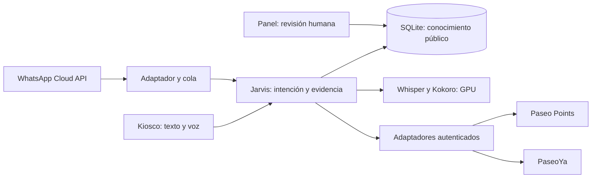

# Adicionales e integraciones de Jarvis

Fecha: 3 de octubre de 2026. Documento de solución propuesta; estas integraciones externas todavía no están conectadas. El prototipo funcional es Jarvis, no una implementación completa de los tres retos.

## Orden recomendado

| Prioridad | Adicional | Valor para el reto | Primera entrega y aceptación |
|---|---|---|---|
| 1 | Administración del conocimiento | Mantiene correctos catálogo, horarios, promociones y eventos | Panel autenticado con borrador/revisión/publicación, responsable, fuente, vigencia y auditoría; un cambio aparece sin reiniciar |
| 1 | Mapa y continuidad en el móvil | Convierte una recomendación en una visita | Plano autorizado, origen del kiosco, rutas accesibles y QR generado localmente; recorrer cinco destinos reales |
| 1 | Analítica de preguntas sin respuesta | Mejora cobertura con evidencia | Conteos por intención/categoría y faltantes; sin grabar audio ni publicar conversaciones personales |
| 2 | Paseo Points | Fidelización y beneficios personalizados | Consultar saldo y beneficios del usuario autenticado, luego proponer un canje con confirmación |
| 2 | WhatsApp | Continuar fuera del kiosco | Adaptador Cloud API para texto y audio con el mismo motor RAG; no repetir una respuesta ante webhooks duplicados |
| 2 | PaseoYa | Del descubrimiento al pedido | Catálogo y stock actuales, enlace al producto o carrito; consultar un pedido autenticado |
| 3 | Personalización | Afinar recomendaciones | Preferencias voluntarias de presupuesto/categoría, consentidas; borrar sesión elimina preferencias |
| 3 | Multidioma | Facilitar acceso | Español e inglés sobre la misma evidencia; probar que traducción conserva precios, fechas y ubicación |
| 3 | Avatar y miradas | Experiencia presencial atractiva | Avatar ya existente; interacción de mirada optativa tras medir falsas activaciones y accesibilidad |

## Arquitectura común

Mantener conocimiento público separado de datos privados. El RAG actual recupera por texto y sinónimos; SQLite y RAG son compatibles. Si las evaluaciones de paráfrasis muestran fallos, sumar embeddings multilingües con índice local y combinar puntuación semántica y léxica. Filtros de tipo, permisos y vigencia se aplican antes de presentar evidencia. Comparar recuperación con una lista de al menos 30 preguntas y registrar precisión, cobertura, latencia y abstenciones. No cambiar la base de datos por moda.

## Paseo Points

### Contrato propuesto, sujeto a acuerdo con su equipo

Endpoints **propuestos**, no existentes ni implementados: `GET /v1/me/points`, `GET /v1/me/benefits`, `POST /v1/redemptions/quote`, `POST /v1/redemptions`. Respuestas con `balance`, `benefit_id`, `points_cost`, `expires_at`, `quote_id`, estado y timestamp. Enviar identidad mediante token validado por el servicio, nunca confiar en un `user_id` proporcionado por el visitante.

Flujo: visitante solicita saldo → QR de vinculación de un solo uso y corta duración → inicia sesión en su móvil → el backend recibe un token de alcance mínimo → consulta Points → muestra información personal en el móvil. En un kiosco público, evitar dejar saldo e identidad visibles después de cerrar la sesión. El QR no contiene documentos, teléfonos, saldo ni credenciales.

Canje: presentar condiciones y costo → generar cotización → confirmación explícita del usuario → enviar clave de idempotencia → mostrar el comprobante **solo tras éxito del sistema de Points**. Timeout o saldo insuficiente no se convierten en un canje supuesto. Jarvis nunca deduce puntos desde historial del chat ni los almacena en el índice público.

Dependencias: API del equipo, proveedor de identidad, scopes, expiración de tokens, reglas de puntos, sandbox y responsable. Aceptación: dos cuentas no pueden consultar datos de la otra; reintentar no duplica canje; cerrar sesión revoca vinculación.

## PaseoYa

Contrato propuesto: búsqueda de catálogo por negocio/categoría, producto por ID, disponibilidad actual, creación de carrito y `GET /v1/me/orders/{id}`. Campos: producto, comercio, precio/moneda, variantes, disponibilidad, vigencia, enlace y estado del pedido. Identidad del comercio y del cliente deben ser consistentes entre apps.

Primero integración de lectura y enlaces; después carrito/checkout en PaseoYa. Precios y stock vienen de la API comercial con fecha de consulta y caducidad corta; no se generan desde un documento antiguo. Reservas, pagos, devoluciones y confirmaciones pertenecen a PaseoYa. Si la API cae, Jarvis puede dar la ubicación del negocio y explicar que no puede confirmar disponibilidad. Webhook de cambios firmado e idempotente actualiza el catálogo público cuando corresponda.

Aceptación: producto agotado no aparece como disponible; cambios de precio se reflejan; usuario solo consulta sus pedidos; pago pendiente no se anuncia pagado. Dependencias: catálogo real, IDs comunes, enlaces, API de pedidos y sandbox.

## WhatsApp

Usar WhatsApp Business Platform / Cloud API y un número del Paseo autorizado. Un servicio aparte recibe HTTPS webhooks, valida desafío y firma de Meta, deduplica por ID del mensaje, persiste trabajo y responde HTTP rápido. Un worker adapta texto a `chat()` y envía respuesta con fuentes/enlaces. El teléfono no equivale a autenticación de Points ni PaseoYa.

Audio: descargar mediante credencial de Meta, limitar tamaño/duración, validar tipo, convertir a WAV PCM y usar Whisper; texto de respuesta por defecto, audio Kokoro opcional. Retención mínima: eliminar medios temporales al terminar y no registrarlos en logs. Usar conversación aislada por canal y usuario; la sesión del kiosco se comparte solamente tras un enlace voluntario con token efímero.

Fuera de la ventana de atención de 24 horas, usar plantillas aprobadas según la política de Meta y consentimiento aplicable. Incluir salida a atención humana; no prometer que Jarvis gestiona todo sin escalamiento. Consultar precios y políticas vigentes al implementar. Fuente: [Política oficial de mensajes de WhatsApp Business](https://business.whatsapp.com/policy/preview?lang=es_LA). La aplicación de estas reglas y el acceso a Cloud API deben revisarse con la cuenta y documentación oficial de Meta al conectar el número.

Endpoints del adaptador propuestos: `GET /webhooks/whatsapp` para verificación y `POST /webhooks/whatsapp` para recepción; health, cola, reintentos acotados y cola de errores. Secretos por entorno, permisos mínimos, nunca en Git. Aceptación: mensaje duplicado genera una respuesta; firma inválida se rechaza; audio corrupto pide repetir; caída de GPU permite texto; falla de envío no repite un canje.

## Panel y calidad del conocimiento

Hoy existe carga JSON autenticada y validación de registros; el panel visual es futuro. Crear roles editor/revisor, historial, vista previa de tarjeta, aprobación responsable, alertas de expiración y trazabilidad de publicación. `updated_at` es versión de ficha; `observed_at` es lectura de fuente; `verified_at` más `verified_by` acreditan revisión humana. Que exista un enlace no acredita aprobación del Paseo.

Cada promoción requiere negocio, beneficio, condiciones, inicio y vencimiento; cada evento inicio/fin, zona, lugar y descripción. Cancelaciones y cambios se publican inmediatamente. Mantener esquemas en `packages/contracts` compartidos entre aplicaciones; antes de unificar bases, acordar los contratos y sus propietarios.

## Mapa, QR y accesibilidad

Obtener plano autorizado y grafo de accesos: pisos, puntos de referencia, ascensores, escaleras, baños y restricciones. Configurar el nodo inicial del kiosco. Calcular rutas con preferencia accesible y probar físicamente. Una ubicación en un directorio no acredita una ruta.

El QR local y la página móvil pública de destino ya están implementados. Falta configurar una URL accesible desde el teléfono y comprobarla en el lugar (`docs/acceso-movil.md`). Para datos privados, diseñar un enlace efímero separado. El enlace público no lleva ID de sesión ni historial. Ofrecer texto, alto contraste, tamaño táctil, control de voz y botón visible para reiniciar. El prototipo escucha con acción del usuario; cualquier detección por cámara requiere una decisión explícita del Paseo y evaluación de privacidad.

## Analítica y operación

Registrar conteos de intención, fuente utilizada, abstención, tiempos STT/recuperación/TTS y errores sin teléfono ni transcripción completa por defecto. Reporte semanal de preguntas faltantes para el revisor. Respaldar SQLite, probar recuperación, versionar fuentes y definir revisión de agenda/promociones diariamente. Mantener limpieza al salir y por inactividad.

## Entregas sugeridas

1. Cerrar datos mínimos reales, panel de revisión simple y ensayo del reto.
2. Plano/acceso móvil y evaluación de voz en el entorno real.
3. Points de lectura + vinculación móvil; WhatsApp texto en sandbox.
4. PaseoYa catálogo/pedidos; audio WhatsApp; canjes con cotización y confirmación.
5. Personalización, multidioma y analítica avanzada según evidencia de uso.

No presentar estos adicionales como terminados en la demo. La prioridad inmediata es contar con fichas actuales y cinco recorridos verificables que demuestren el valor de Jarvis.
