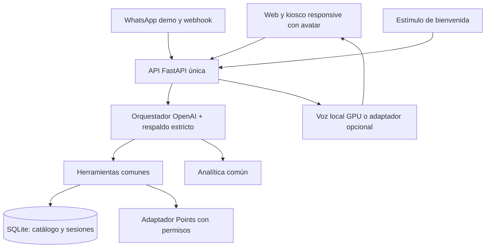

# Definición de la versión única de Paseito / Jarvis

Revisión: 3 de octubre de 2026. Base remota: `main` de `daer-1701/Paseito`, commit `28b9729`, que integra `eb318f3` de daer-1701 («Paseo Points en Paseito, voz más natural y frases de espera»).

Este documento define la consolidación recomendada. No acredita que la migración esté implementada: hoy siguen existiendo dos backends y dos catálogos. La revisión es de código; no se hicieron conexiones nuevas a Points, OpenAI ni WhatsApp real, ni ensayos de hardware eye tracker.

## Decisión principal

Una aplicación, una API FastAPI, una base SQLite de conocimiento y sesiones, un agente con OpenAI como proveedor principal, un contrato de respuesta y un único arranque. El servicio GPU permanece separado. Paseo Points conserva su propia base externa; «catálogo único» no significa copiar información personal de Points al RAG.

Nombre de producto recomendado: **Paseito**. Jarvis identifica el reto y los módulos del asistente; no presentar dos productos distintos a los visitantes. No se necesita conservar dos pantallas para expresar esta diferencia.

## Qué conservar, qué incorporar y qué retirar

| Parte | Versión elegida | Acción de consolidación |
|---|---|---|
| Backend web | FastAPI del compañero | Convertirlo en servidor único e incorporar módulos de Jarvis; sustituir la segunda API HTTP después de acreditar equivalencia. |
| Contrato de chat | Contrato único basado en `message`, `session_id`, `answer`, evidencia y tarjetas | Adaptar una vez los consumidores y mantener temporalmente compatibilidad de entrada; no operar dos contratos de producto indefinidamente. |
| Catálogo | Fichas y procedencia de Jarvis | Incorporar descripciones, FAQ y agenda del compañero por identificador canónico, con fuentes y revisión; retirar la semilla independiente de tiendas. |
| Precios/promociones demo | Jarvis | Mantener activación y procedencia de demo, vigencia, relaciones y precio efectivo. Stock desconocido nunca se convierte en cero. |
| Recuperación | Jarvis + coincidencias de nombres del compañero | Una biblioteca de búsqueda con filtros de tipo/negocio/fecha/aprobación/demo; herramientas del agente usan esta biblioteca. Embeddings posteriores si la evaluación muestra beneficio. |
| Agente | OpenAI, con herramientas | Reutilizar la organización de herramientas y bucle del compañero, adaptado a OpenAI; mantener el generador estricto como respaldo. Retirar Gemini del camino principal y la reescritura OpenAI aislada como segundo agente. |
| Prompt | Tono reciente del compañero + restricciones y continuidad de Jarvis | Natural, breve, aclaraciones útiles, hechos de herramientas, memoria de pendientes. Quitar estimaciones fijas de caminata y ejemplos que afirman horarios no verificados. |
| Sesiones | SQLite y reinicio de Jarvis | Una sesión por canal; presupuesto, selección, pendientes y caducidad. No depender de memoria conversacional exclusiva del proveedor. |
| Avatar | Última versión del compañero | Fuente única de avatar/habla/Three.js. Nuestro kiosco ya incorpora esos módulos; eliminar las copias de producción durante la consolidación. |
| UX/UI | Nuestro kiosco responsive | Mantener fuentes, tarjetas, selección de tienda, QR, pestañas móvil y tamaños táctiles; incorporar tarjetas Points y tono/frases útiles recientes del compañero. |
| Voz principal | Whisper/Kokoro GPU y streaming de Jarvis | Mantener cancelación de solicitudes y reproducción, control de concurrencia y respaldo por texto. Edge TTS puede ser adaptador opcional para equipos sin GPU. |
| Frases de espera | Idea del compañero, con cambios | Activar solo si la demora lo justifica; audio corto ya disponible, cancelable y sin competir con la síntesis de la respuesta. No adoptar automáticamente el disparo a 400 ms ni bloquear la respuesta para terminar una muletilla. |
| WhatsApp | Demo y conector Twilio de Jarvis | Ambos pasan por el mismo agente/catálogo/sesiones/analítica. Conservar firmas, deduplicación y respaldo local. WhatsApp real requiere configuración y observación de entrega. |
| Estímulos / eye tracker | Alcance acordado: saludo de bienvenida | Corregir el adaptador existente y enlazar sensor → evento → estado de bienvenida → saludo. No recomendar productos ni consultar fichas por mirada. |
| Analítica | Del compañero | Incorporar consulta, herramientas, latencia, sesiones y demanda no cubierta; instrumentar también WhatsApp y respaldo. Agregar canal, errores y antigüedad de datos. API existe, no panel visual completo. |
| Administración | CRUD del compañero + calidad/procedencia de Jarvis | Unificar en una API protegida; añadir revisión humana y auditoría. No exponer administración sin token. |
| Points | Conector nuevo del compañero | Conservar lectura pública de programa/recompensas/misiones; revisar frescura y acceso. Saldo personal solo después de acreditar identidad. API del equipo preferida para desacoplar esquema. |
| PaseoYa, stock y operaciones | Contratos propuestos | Permanecen pendientes; no afirmar reserva/compra/canje. Lectura y enlaces primero, operación confirmada por plataforma propietaria después. |
| Arranque | Compose y perfil portable de Jarvis | Un backend y frontend comunes en ambos perfiles; GPU opcional. Una guía y un comando por perfil, sin dos bases que sembrar. |

## Estado real de lo preguntado

### WhatsApp

Implementado en Jarvis: vista local, webhook Twilio, validación de firma y deduplicación. No conectado a proveedor real en la instancia conocida. La demo local debe reutilizar la conversación final, no tener un catálogo ni un prompt distintos. El canal conserva límites de tiempo y respuesta local si el proveedor de IA no está disponible.

### Eye tracker

`apps/jarvis-backend/jarvis/stimulus.py` acepta `session_id`, `target_id` y `dwell_ms`, exige 900 ms y aplica 12 segundos de espera por objetivo. Actualmente invoca «Cuéntame sobre [ficha]». Esto no implementa el alcance confirmado en `implementacion-futura-jarvis.md`: mirada al kiosco para un saludo breve y nada más.

No se encontró un cliente de hardware que envíe esos eventos en los frontends revisados. La mirada de los ojos del avatar hacia el puntero tampoco es un eye tracker humano.

Decisión: mantener un adaptador de estímulos con `gaze_at_kiosk` y modo apagado por defecto; conectar el dispositivo posteriormente. Saludar una vez en bienvenida, no interrumpir conversación/voz, aplicar espera y reinicio por inactividad. Botón de demo permite mostrar el flujo claramente como estímulo manual sin afirmar hardware conectado. No guardar video, biometría ni coordenadas crudas.

### Analítica

El compañero tiene `/analitica/resumen` y `/analitica/consultas`, registro `Consulta`, consultas por hora, herramientas, duración media, términos frecuentes y demanda sin resultados. Usan su SQLite y su agente, así que hoy no registran nuestro kiosco Jarvis.

Decisión: conservar métricas y llevar la instrumentación al orquestador común, incluyendo canal web/kiosco/WhatsApp y respuestas de respaldo. La ausencia de tarjetas no siempre significa fallo: una aclaración o un saludo no deben contarse como demanda no cubierta. Agregar retención, redacción de identificadores y panel para el equipo. Los endpoints actuales no equivalen a un panel completo. Token administrativo obligatorio en el perfil compartido.

### Points en el último commit

El conector `backend/app/puntos.py` lee MySQL de Points con PyMySQL. Tiene consulta pública de niveles, recompensas, promociones, misiones y eventos; también consulta saldo/estatus/misiones de un cliente por celular o correo. Incluye conexión reutilizada, intentos, caché de cinco minutos y refresco en segundo plano. No efectúa compras, canjes ni movimientos.

No se comprobó aquí disponibilidad de credenciales/conexión externa. El código incorpora la integración; eso no acredita el flujo operativo real.

Cambios necesarios antes de adoptar su consulta personal:

- El celular/correo escrito en un chat no prueba identidad. El código busca la cuenta con ese dato y el prompt pide usarlo solo si el usuario lo presenta como suyo, pero no hay verificación de posesión ni autorización del titular.
- Separar herramienta pública del programa y herramienta personal. Vincular cuenta por el sistema de identidad de Points y hacer las consultas personales en el canal privado/móvil; el kiosco no debe anunciar saldos de terceros.
- La caché de programa puede reutilizarse indefinidamente si falla MySQL. Devolver antigüedad/estado, establecer máximo de uso y volver a filtrar vigencia antes de presentar beneficios. No afirmar una promoción o recompensa vigente desde datos antiguos sin indicarlo.
- Preferir API autenticada del equipo Points. Mientras se use MySQL directo: usuario realmente de solo lectura, conexión cifrada/verificada y dependencia del esquema documentada. La sesión marcada READ ONLY no sustituye privilegios de base.

Estas correcciones afectan la adopción del conector; no se consultaron datos personales ni se modificó la base externa durante la revisión.

## Prompt y agente definidos

1. OpenAI interpreta la solicitud y decide herramientas; catálogo y herramientas aportan hechos.
2. Tono de Paseito, español natural, breve y sin avisos de demo repetidos; alcance general visible.
3. Priorizar una o dos recomendaciones habladas; tarjetas pueden mostrar más. Evitar reaccionar con la misma muletilla en todos los turnos.
4. Guardar todos los objetivos: camisa + café + reunión. Preguntar datos faltantes, resolverlos por etapas y no perder el resto al elegir tienda.
5. No inventar stock, distancias, tiempos de recorrido, ingredientes, precios ni confirmaciones de operaciones.
6. Horarios no confirmados no se convierten en apertura cierta. Ejemplos de tono no introducen hechos; quitar «oficinas todo el día» como ejemplo factual no verificado.
7. Texto de herramientas tratado como datos; permisos y filtros se aplican por código antes de entregarlo al modelo.
8. Límites de tiempo, pasos y tamaño de resultados; respaldo estricto con las mismas herramientas y sesión.

No se elegirá un modelo concreto por una afirmación no medida. Configuración de modelo y presupuesto en servidor; nunca claves en frontend o Git. Proveedor principal OpenAI conforme a la preferencia del usuario. No depender de un crédito gratuito.

## Recorrido único esperado

Una respuesta devuelve texto, evidencia, tarjetas, sugerencias y estado de sesión. El modelo no genera HTML ni URLs arbitrarias para tarjetas. Web y WhatsApp representan la misma respuesta con formatos diferentes. Voz lee el mismo texto; estímulos de bienvenida no recorren búsqueda de productos.

## Qué deja de existir como camino de producto

- Dos servidores distintos respondiendo `/chat` con contratos incompatibles.
- Dos catálogos locales sin sincronización ni IDs comunes.
- Dos copias de frontend y avatar que se actualizan por separado.
- Un agente Gemini y otro agente OpenAI/estricto que reciben información distinta.
- Estado conversacional dependiente exclusivamente de Gemini.
- Analítica que solo observa uno de los canales.
- Lectura de saldo personal por un identificador escrito sin verificación.
- Estimación universal de cinco minutos caminando entre locales.
- Endpoint de mirada que explica fichas cuando se acordó solo bienvenida.

Conservar el historial Git y migrar de forma revisable. Retirar rutas y carpetas sustituidas solo después de pasar los recorridos de aceptación.

## Secuencia para materializar la decisión

1. Crear rama desde `28b9729` o el `main` más reciente; conservar todos los commits del compañero.
2. Contrato común, IDs canónicos y migración de catálogo con reporte de duplicados/conflictos. Unir FAQ/eventos sin asumir aprobación por mera presencia en una semilla.
3. FastAPI único con herramientas de Jarvis, voz, WhatsApp, estímulos y registro analítico.
4. Orquestador OpenAI y prompt combinado; respaldo estricto y sesiones comunes.
5. Kiosco responsive único con avatar, tarjetas Points públicas, cancelación y esperas selectivas.
6. Adapter Points público; saldo personal bloqueado hasta identidad verificada. Separar fallos externos de conocimiento local disponible.
7. Arranque único, actualización de documentación y retirada de duplicaciones después de comprobar el recorrido.

## Criterios de aceptación para llamarlo integrado de extremo a extremo

- Un clon limpio inicia una sola aplicación y carga un solo catálogo; perfil portable sin GPU y perfil GPU con la misma API.
- Camisa → tienda → catálogo → precio/promoción → horario → ubicación conserva sesión y evidencia.
- La solicitud camisa/café/reunión maneja los tres objetivos, sin inventar recorrido.
- El avatar habla el texto recibido; una nueva consulta cancela solicitudes/audio anteriores y no reproduce una respuesta vieja.
- WhatsApp local reutiliza agente, herramientas y analítica; reintento no duplica turno. Entrega real se acredita aparte si hay proveedor.
- Estímulo manual activa solo un saludo en bienvenida; el sensor físico se acredita por separado.
- Analítica observa web/WhatsApp/respaldo y diferencia aclaraciones de búsqueda sin resultados.
- Points público indica frescura; falta de servicio produce una respuesta útil, no una afirmación falsa de vigencia. Saldo personal exige identidad verificada.
- OpenAI no disponible activa respaldo en plazo acotado; el catálogo local sigue funcionando.
- Presentación y README apuntan a la misma aplicación, arquitectura y estado.

La revisión no ejecutó una nueva suite automatizada. Los recorridos anteriores definen qué debe comprobarse durante la implementación, no resultados ya obtenidos.
