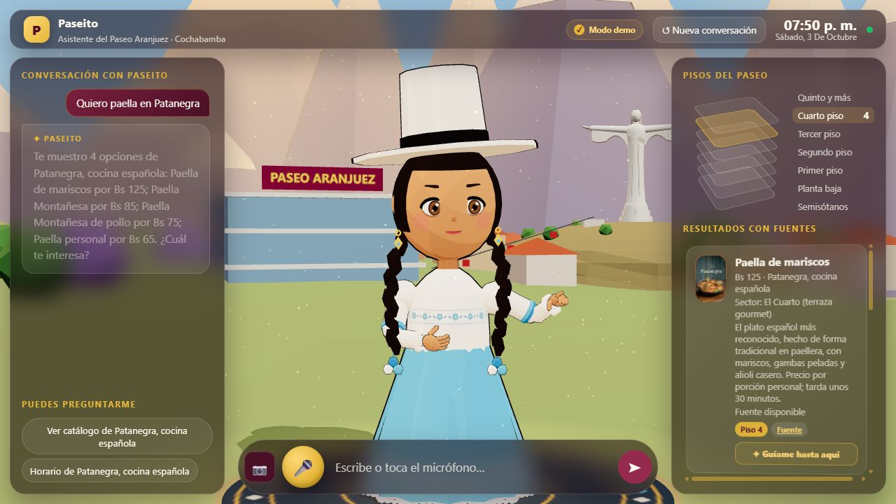

# Etapa 1: aportes del compañero sobre la aplicación unificada

> Informe histórico. El estado vigente está en [versión única](version-unica-estado.md) y el alcance del PDF en [fase 3](fase3-limpieza-y-alcance.md). Conteos, porcentajes, arquitectura y pendientes de este informe corresponden a su entrega original.

Base: `985b72f`. Fuente de aportes: `6a28f76` (main observado el 3 de octubre de 2026).

## Alcance aprobado

1. Incorporar avatar cochabambino y 20 imágenes locales.
2. Importar 120 productos y las etiquetas nuevas de tres restaurantes al catálogo SQLite. Conservar precios existentes ante coincidencias y registrar diferencias para revisión. No convertir fuentes declaradas por el compañero en aprobación comercial.
3. Incorporar lector QR, entrada manual y consulta de cupones en FastAPI, con validación de QR de cliente por API/HMAC. Usar el lector MySQL seguro existente. No habilitar búsqueda personal por teléfono/correo ni canje.
4. Añadir tarjetas y resumen hablado de cupones a la interfaz existente. Conservar voz GPU, sesiones, cancelación y analítica común.
5. Incorporar reglas útiles de tono cochabambino y caché acotada de audio frecuente; Edge ya es una opción del servidor unificado.
6. Build y recorridos manuales de presentación. No añadir ni ejecutar suites automatizadas.
7. Commit de la primera etapa, dejarla disponible para revisión y detenerse antes de la segunda.

## Segunda etapa, pendiente de discusión

Consulta personal por teléfono/correo, políticas de identidad y acceso a otros cupones, política de caché/TLS de Points, reintentos, tiempos de caminata y cambios de arquitectura anteriores. No restaurar servidores, bases o agentes duplicados.

## Registro de ejecución

- Rama de trabajo: `feat/aportes-companero-etapa1`, creada sobre nuestra versión unificada.
- La apertura propuesta de Cayenna a las 11:00 difiere de nuestros datos y no está confirmada: queda para revisión, sin reemplazar horarios activos.

## Resultado para revisión

- 120 productos nuevos: Cayenna 71, Patanegra 47 y Chipotle 2. Cero coincidencias exactas y cero precios existentes reemplazados. Los menús son fuentes declaradas por el compañero; no se acredita validación comercial independiente. Se conservan también los productos demo existentes.
- 20 imágenes relacionadas con los identificadores canónicos y avatar cochabambino recuperados de su commit. Descripciones y etiquetas de platos disponibles para búsqueda.
- Lector con cámara, código manual, validación API/HMAC, tarjetas, resumen hablado y vínculo a ficha/QR de tienda. Ejemplo local explícito sin canje.
- Decisión de alcance: un código muestra solamente ese cupón. El QR de cliente validado permite consultar sus cupones, sin habilitar saldo personal ni búsqueda por teléfono/correo. El acceso a otros cupones a partir de un código queda para discutir en etapa 2.
- Transporte de la validación: HTTPS fuera de localhost y sin redirecciones del POST que contiene la clave de integración. Se conserva la conexión TLS y la caché de Points de nuestra arquitectura; no se restauran las políticas anteriores.
- Prompt: identidad cochabambina, pronunciación y respuestas breves, preservando herramientas, selección, respaldo local y restricciones existentes. Su efecto con OpenAI no se midió porque no hay clave configurada.
- Voz Edge existente preservada; caché de audio corto limitada a 64 entradas y 32 MB. Voz GPU permanece en servicio. Edge externo no se invocó durante esta revisión.

## Evidencia observada

Build Docker final y arranque: `/health` devuelve 1.801 registros. Consulta de chimichanga en Chipotle devuelve Bs 50; consulta de paella en Patanegra muestra productos añadidos y anteriores. Lector manual informa que Points real no está conectado y permite abrir el ejemplo local. El ejemplo presenta cupón y resumen hablado, y la guía enlaza la ficha/QR de Almacén de Pizzas (ambos responden 200). Interfaz revisada en escritorio y vista móvil.

Revisión final estática con contexto fresco: corregidos resultados cruzados entre consultas de cupones, identificador del destino y protección del transporte de validación. No se añadieron ni ejecutaron suites automatizadas. No se comprobó lectura de cámara física, Points externo, API/HMAC con credenciales reales ni síntesis Edge externa.

**Parada solicitada:** primera etapa disponible para revisión. La segunda etapa no empezó.
