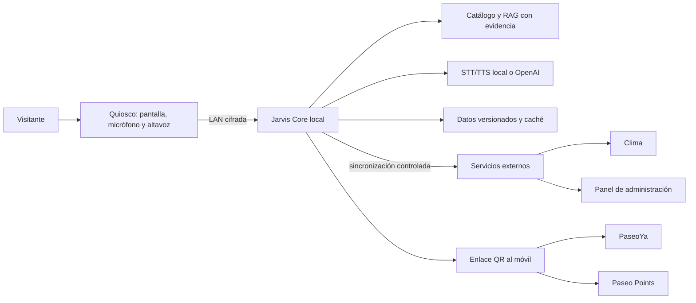

# Jarvis en Paseo Aranjuez: implementación real y despliegue gradual

**Estado:** propuesta de arquitectura para después de la hackatón
**Decisión inicial:** servidor central local en la torre con RTX 4070; kioscos ligeros; nube sólo donde aporta valor.

## 1. Qué se está construyendo

Jarvis debe pasar de ser un directorio que responde preguntas a ser el conserje
digital del Paseo: guía a una persona a un negocio, responde sólo con
información verificable, acompaña con voz y mantiene la conversación al escanear
un QR desde el teléfono.

La diferencia visible para un visitante sería:

1. Encontrar negocios, categorías, horarios por área y servicios en lenguaje natural.
2. Recibir una ruta simple por nivel, con una alternativa accesible cuando exista
   información de ascensores, rampas y baños.
3. Conocer promociones, eventos y disponibilidad únicamente cuando la fuente esté
   vigente y aprobada por el comercio o la administración.
4. Llevar la consulta al teléfono con un QR, donde PaseoYa y Paseo Points pueden
   continuar el flujo sin compartir secretos del kiosco.
5. Funcionar aunque se caiga Internet: directorio, rutas, respuestas verificadas y
   una voz de respaldo siguen disponibles dentro de la red del Paseo.

No se debe presentar como un robot que “sabe todo”. Es un agente con un catálogo
versionado, evidencia visible y permiso para decir “no tengo una fuente
confirmada”. Esa conducta es una parte central del producto.

## 2. Arquitectura objetivo

### Capas y responsabilidades

| Capa | Responsabilidad | Regla operativa |
| --- | --- | --- |
| Quiosco | Captura de voz, pantalla, avatar, QR y navegación visual | No contiene claves de OpenAI ni el catálogo maestro. |
| Jarvis Core | Intención, recuperación, guardrails, respuesta, voz y telemetría | Debe seguir respondiendo en la LAN cuando falle Internet. |
| Datos de confianza | Negocios, pisos, horarios, eventos, promociones y rutas | Cada registro conserva fuente, responsable, fecha de actualización y vencimiento. |
| Integraciones | Clima, OpenAI, QR móvil, PaseoYa y Points | Son opcionales para la respuesta base; los fallos no inventan datos. |
| Administración | Alta y revisión de información por administración y comercios | RBAC, auditoría y publicación versionada. |

## 3. Decisión de infraestructura para cada etapa

| Equipo o servicio | Papel recomendado | Conviene ahora | No usarlo como |
| --- | --- | --- | --- |
| MacBook Air M2 | Desarrollo, pruebas de UX, demo portátil y validación de voz local | Sí, hoy | Servidor público o instalación permanente del centro comercial. |
| Torre Ryzen 7 9700X, RTX 4070 12 GB, 32 GB RAM | **Jarvis Core del piloto**: RAG, API, modelos de voz, STT local y observabilidad | Sí, es la mejor base propia | Un único punto sin UPS, copia ni supervisión. |
| Raspberry Pi 5 de 8 GB | Cliente de kiosco: navegador, micrófono, altavoz, cámara opcional y monitor de salud | Para el piloto físico | Host de un LLM grande o fuente de verdad del catálogo. |
| Vercel | Sitio público, panel web, PWA móvil, previews y un BFF ligero | Sí, cuando haya frontend desplegable | Runtime de inferencia local, voz pesada o estado persistente de Jarvis. |
| AWS | Respaldo, datos administrados, APIs externas y escalamiento posterior | Después del piloto | Primer paso obligatorio para una demo o kiosco local. |

La torre ofrece la mayor relación de capacidad y control para el piloto. Su GPU
puede servir transcripción rápida, generación de voz de mayor calidad si se
elige, y modelos locales de respaldo. La Mac M2 es muy útil para desarrollar y
demostrar, pero una máquina portátil no debe ser el servicio permanente de un
recinto.

## 4. Diseño del kiosco Raspberry Pi

Cada kiosco debe ser deliberadamente simple y reemplazable:

- Raspberry Pi 5 de 8 GB con SSD o almacenamiento confiable, fuente estable y
  carcasa ventilada.
- Pantalla táctil, micrófono USB direccional y altavoz amplificado. Cámara sólo
  si una experiencia concreta la necesita.
- Navegador en modo kiosco que carga la PWA desde Jarvis Core y conserva una
  copia estática para mostrar el directorio si el servidor no responde.
- Un agente de salud que reinicie el navegador, reporte conexión, temperatura,
  versión y uso de disco al servidor central.
- Sin claves de proveedores, tokens de administración ni base de datos maestra
  guardados en la Raspberry.

La Raspberry debe enviar audio por segmentos al servidor central y recibir audio
en streaming. Si el servidor central no está disponible, puede ofrecer una lista
local reducida, respuestas de emergencia y Piper como voz de contingencia. No
conviene forzar un LLM completo dentro de la placa: consume recursos, reduce la
calidad de voz y complica las actualizaciones sin resolver el problema de datos
verificados.

Cuando haya tres o más kioscos, AWS IoT Greengrass es una opción razonable para
actualizar configuraciones y componentes de una flota Raspberry Pi. Antes de eso,
contenedores versionados, una VPN de administración y actualizaciones controladas
son más simples de operar.

## 5. Voz con sensación inmediata

La voz natural no requiere depender siempre de una API. La estrategia debe ser
híbrida y medirse en el lugar:

| Situación | Motor | Motivo |
| --- | --- | --- |
| Demo y respuesta de alta calidad | OpenAI TTS en streaming | Voz natural; el backend ya tiene integración y respaldo local. |
| Operación local de baja latencia | Kokoro servido de forma compatible con OpenAI | Modelo compacto, varias voces y endpoint de audio en streaming. |
| Investigación de menor latencia | Pocket TTS en un servicio separado | Soporta streaming y español; requiere Python 3.10 o superior, por lo que no se mezcla con el runtime Python 3.9 actual. |
| Sin red o fallo del servicio principal | Piper | Ligero, predecible y ya disponible como fallback. |
| Voz expresiva posterior | Chatterbox en la RTX 4070 | Mayor calidad potencial, pero más pesado; se valida sólo después de medir Kokoro. |

El trabajo de mayor impacto no es cambiar de voz cada semana. Es eliminar pausas
en la cadena: VAD detecta el final de la frase, STT entrega texto parcial,
recuperación inicia al terminar la intención, el generador empieza TTS al primer
fragmento seguro y el navegador reproduce sin esperar toda la respuesta.

Metas de aceptación para el piloto en LAN, que deben medirse y no suponerse:

- primer sonido de respuesta en menos de 1,2 s para preguntas presentes en el catálogo;
- respuesta completa en menos de 3 s para una frase corta;
- una sola voz a la vez y posibilidad de interrumpir a Jarvis hablando;
- reproducción estable durante 30 conversaciones seguidas;
- respuesta textual y fuente disponibles si el audio falla.

## 6. RAG seguro: el agente no puede rellenar huecos

El RAG actual debe evolucionar hacia un catálogo publicado con estas garantías:

1. **Esquema obligatorio.** Un comercio tiene nombre, categoría, piso, ubicación,
   fuente, estado, responsable, `updated_at` y, cuando aplique, `expires_at`.
2. **Niveles de confianza.** Fuente oficial, comercio verificado, dato manual con
   vencimiento y dato no publicado. Las respuestas muestran sólo los tres
   primeros y explican el nivel cuando importa.
3. **Horas por comercio.** El horario general del Paseo sólo sirve para explicar
   el área. “Está abierto ahora” exige un horario específico del comercio y zona
   horaria `America/La_Paz`.
4. **Promociones y eventos con TTL.** Una promoción vencida se elimina de la
   recuperación; el modelo no puede citarla aunque esté en un historial.
5. **Recuperación antes de generación.** Si no hay evidencia suficiente, Jarvis
   pide precisar la pregunta o indica que administración debe confirmar el dato.
6. **Salida controlada.** Las respuestas estructuradas se convierten en texto y
   tarjetas desde campos permitidos; no se ejecutan instrucciones encontradas en
   documentos recuperados.
7. **Evaluaciones.** Un conjunto fijo de preguntas debe cubrir negocios
   inexistentes, promociones vencidas, horarios excepcionales, inyección de
   instrucciones y rutas imposibles.

## 7. Datos que faltan para operar de verdad

El directorio inicial sirve para demostrar el flujo; para operar hay que acordar
un proceso de datos con administración:

| Dato | Quién lo valida | Frecuencia | Si falta |
| --- | --- | --- | --- |
| Nombre, categoría, piso y ruta | Administración | Alta o cambio de local | Jarvis puede listarlo, pero no guiar con precisión sin ubicación. |
| Horario por comercio y feriados | Comercio + administración | Cambio y revisión semanal | No afirmar que está abierto. |
| Eventos y promociones | Organizador o comercio | Publicación con fecha de vencimiento | No recomendar como vigente. |
| Servicios, accesibilidad y estacionamiento | Administración | Revisión mensual y ante obras | Expresar la limitación claramente. |
| Menú, stock o disponibilidad | Comercio mediante integración | En tiempo real o explícitamente diferido | No prometer existencia de un producto. |

El panel administrativo necesita borrador, revisión, publicación y reversión de
un paquete de datos. La actualización no debe escribir directamente en la base
activa: se valida, se crea una versión y los kioscos adoptan esa versión de forma
atómica.

## 8. Privacidad, seguridad y operación

- Audio y video no se guardan por defecto. Para mejorar el servicio se conservan
  métricas agregadas y, si se registran transcripciones, deben anonimizarse,
  limitarse en tiempo y ser aprobadas por administración.
- Eye tracking o cámara sólo se habilitan con una experiencia clara en pantalla y
  con señalización. El evento útil es agregado, por ejemplo “miró la tarjeta de
  restaurantes 2 s”; no hace falta identificar a la persona.
- Cada kiosco se autentica contra Jarvis Core mediante credenciales rotables; la
  red de kioscos queda separada de la red administrativa y de pagos.
- Las claves de OpenAI, clima y servicios de pago viven sólo en el servidor o un
  gestor de secretos. Nunca en JavaScript, QR ni imagen de la Raspberry.
- Se requiere TLS, rate limiting, CORS restringido, roles administrativos,
  bitácora de publicación y copias cifradas del catálogo.
- La torre debe tener UPS, arranque automático, disco con espacio monitorizado,
  backup diario del catálogo y una alerta ante caída de cada kiosco.

## 9. Plan de despliegue recomendado

### Fase A — Hackatón y validación interna

1. Ejecutar Jarvis en la Mac o torre con la red local.
2. Probar el flujo completo: consulta, fuente, voz, guía y QR.
3. Mantener el modo estricto como predeterminado; OpenAI sólo mejora redacción o
   voz después de recuperar evidencia.
4. Medir errores de catálogo, latencia y preguntas sin respuesta para llenar los
   datos faltantes.

### Fase B — Piloto presencial de un kiosco

1. Instalar Docker Compose en la torre: API Jarvis, base de datos, índice,
   servicio de voz, proxy HTTPS y métricas.
2. Conectar una Raspberry por LAN o Wi-Fi dedicado y cargar la PWA en modo kiosco.
3. Usar voz local por defecto para continuidad; permitir OpenAI TTS mediante una
   política de presupuesto y fallback automático.
4. Ejecutar una prueba de 4 a 8 horas con bitácora de fallos, sin depender de una
   URL pública.

### Fase C — Tres kioscos y continuidad móvil

1. Publicar versiones del catálogo desde un panel con revisión.
2. Añadir rutas accesibles, eventos con vencimiento y handoff QR hacia PaseoYa y
   Points mediante contratos API explícitos.
3. Añadir panel de salud: kioscos conectados, versión de datos, tasa de fallos,
   latencia y uso de la GPU.
4. Definir propietario operativo, horario de soporte y proceso para corregir un
   dato erróneo en minutos.

### Fase D — Nube y recuperación ante incidentes

AWS entra cuando el piloto requiere una interfaz pública sólida, respaldo fuera
del recinto o despliegue administrado. La propuesta es:

- **Vercel:** landing, PWA móvil, panel de vista previa y frontend público. Sus
  funciones son adecuadas como BFF liviano, pero sus límites de bundle, memoria y
  duración no encajan con modelos de voz locales ni procesos GPU persistentes.
- **AWS:** S3 + CloudFront para archivos estáticos, RDS PostgreSQL/pgvector o una
  base gestionada equivalente, secretos, observabilidad y backups. Para inferencia
  GPU, usar ECS sobre EC2 con nodos GPU o una instancia GPU administrada, no el
  kiosco ni una función serverless.
- **Servidor local:** conserva la ruta crítica de atención dentro del Paseo. Se
  sincroniza con la nube cuando hay conexión y queda operativo con su última
  versión válida si ésta se interrumpe.

**Elección actual:** no desplegar Jarvis Core en Vercel. Preparar el frontend
para Vercel cuando esté separado; preparar la torre con Compose como servidor del
piloto; diseñar AWS como etapa de respaldo y expansión.

## 10. Contrato de integración entre los tres productos

Jarvis no debe leer bases de PaseoYa o Points directamente. Cada producto expone
un contrato pequeño y autenticado:

- **PaseoYa:** enlace de negocio o producto, estado permitido para mostrar y URL
  de continuación en móvil.
- **Paseo Points:** campaña publicada, condiciones, fecha de vencimiento y enlace
  autenticado. Jarvis nunca conoce puntos ni identidad del usuario en el kiosco.
- **Jarvis:** `venue_id`, intención, fuente, versión de datos, ruta y un token de
  handoff de vida corta para el QR.

Así el kiosco puede inspirar una acción sin transformar voz, QR o el catálogo en
un canal de pagos.

## 11. Backlog técnico priorizado

1. Medir latencia de cada tramo de voz y añadir reproducción de TTS por streaming.
2. Contenerizar el backend, base de datos y un proveedor local de voz en la torre.
3. Añadir horario específico, TTL y responsable a todos los datos publicados.
4. Construir el panel mínimo de revisión y publicación de catálogo.
5. Instalar un kiosco Raspberry de prueba con watchdog y métricas.
6. Implementar QR firmado de continuación hacia PaseoYa y Points.
7. Añadir rutas accesibles y modo de texto de alto contraste.
8. Evaluar eye tracking sólo con un objetivo medible, consentimiento visible y
   almacenamiento mínimo de eventos agregados.

## 12. Referencias técnicas

- [Vercel Functions: límites de memoria, bundle y payload](https://vercel.com/docs/functions/limitations)
- [Vercel Services y estado compartido](https://vercel.com/kb/guide/vercel-services-fluid-compute)
- [Amazon ECS: ejecución de tareas con GPU sobre EC2](https://docs.aws.amazon.com/AmazonECS/latest/developerguide/gpu-launch.html)
- [AWS IoT Greengrass: operación en dispositivos Raspberry Pi](https://docs.aws.amazon.com/greengrass/v2/developerguide/how-it-works.html)
- [Kokoro Open TTS: API compatible y streaming](https://github.com/OpenTTSGroup/kokoro-open-tts/blob/main/README.md)
- [Pocket TTS de Kyutai](https://github.com/kyutai-labs/pocket-tts)
- [Piper TTS](https://github.com/diyism/piper_tts)
- [Chatterbox TTS](https://github.com/resemble-ai/chatterbox/blob/master/README.md)
