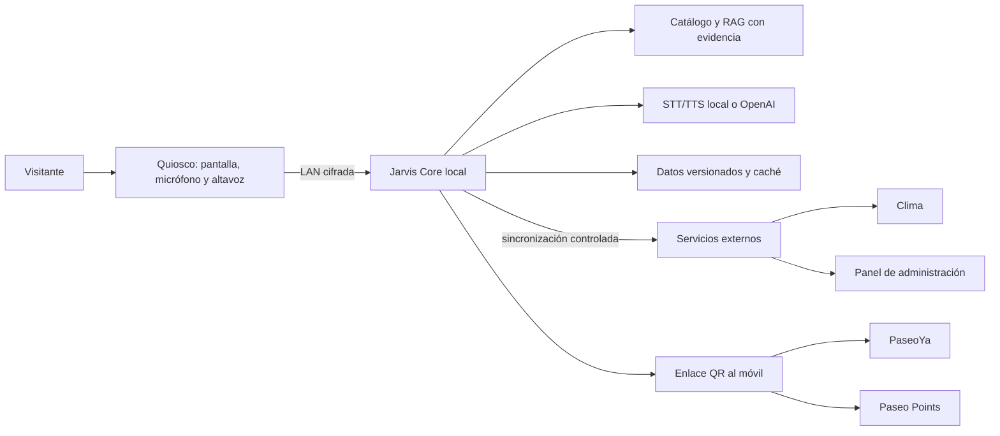

# Jarvis en Paseo Aranjuez: implementación real y despliegue gradual

**Estado:** propuesta de arquitectura para después de la hackatón
**Decisión inicial:** servidor central local en la torre con RTX 4070; kioscos ligeros; nube sólo donde aporta valor.

Ya existe una configuración de arranque para el piloto en
[Windows 11, WSL2 y RTX 4070](arranque-torre-windows.md), con Docker Compose,
Whisper/Kokoro residentes y audio por segmentos. Está pendiente validar el build
CUDA y medir la latencia en la torre. Las fases posteriores de este documento
siguen siendo propuestas, no capacidades desplegadas.

## 1. Qué se está construyendo

Jarvis debe pasar de ser un directorio que responde preguntas a ser el conserje
digital del Paseo: guía a una persona a un negocio, responde sólo con
información verificable, acompaña con voz y mantiene la conversación al escanear
un QR desde el teléfono.

La diferencia visible para un visitante sería:

1. Encontrar negocios, categorías, horarios por área y servicios en lenguaje natural.
2. Recibir una ruta simple por nivel, con una alternativa accesible cuando exista
   información de ascensores, rampas y baños.
3. Conocer promociones, eventos y disponibilidad únicamente cuando la fuente esté
   vigente y aprobada por el comercio o la administración.
4. Llevar la consulta al teléfono con un QR, donde PaseoYa y Paseo Points pueden
   continuar el flujo sin compartir secretos del kiosco.
5. Funcionar aunque se caiga Internet: directorio, rutas, respuestas verificadas y
   una voz de respaldo siguen disponibles dentro de la red del Paseo.

No se debe presentar como un robot que “sabe todo”. Es un agente con un catálogo
versionado, evidencia visible y permiso para decir “no tengo una fuente
confirmada”. Esa conducta es una parte central del producto.

El avatar, la voz y el RAG son componentes que otros pueden copiar. La ventaja
práctica que sí podemos construir es cerrar el recorrido: **dato confirmado →
respuesta con fuente → ruta correcta y accesible → continuidad en el móvil →
acción útil**. Mantener esa cadena confiable exige integrar operación de
administración, comercios y los tres productos; una demo vistosa por sí sola no
la reemplaza.

## 2. Arquitectura objetivo

### Capas y responsabilidades

| Capa | Responsabilidad | Regla operativa |
| --- | --- | --- |
| Quiosco | Captura de voz, pantalla, avatar, QR y navegación visual | No contiene claves de OpenAI ni el catálogo maestro. |
| Jarvis Core | Intención, recuperación, guardrails, respuesta, voz y telemetría | Debe seguir respondiendo en la LAN cuando falle Internet. |
| Datos de confianza | Negocios, pisos, horarios, eventos, promociones y rutas | Cada registro conserva fuente, responsable, fecha de actualización y vencimiento. |
| Integraciones | Clima, OpenAI, QR móvil, PaseoYa y Points | Son opcionales para la respuesta base; los fallos no inventan datos. |
| Administración | Alta y revisión de información por administración y comercios | RBAC, auditoría y publicación versionada. |

## 3. Decisión de infraestructura para cada etapa

| Equipo o servicio | Papel recomendado | Conviene ahora | No usarlo como |
| --- | --- | --- | --- |
| MacBook Air M2 | Desarrollo, pruebas de UX, demo portátil y validación de voz local | Sí, hoy | Servidor público o instalación permanente del centro comercial. |
| Torre Ryzen 7 9700X, RTX 4070 12 GB, 32 GB RAM | **Jarvis Core del piloto**: RAG, API, modelos de voz, STT local y observabilidad | Sí, es la mejor base propia | Un único punto sin UPS, copia ni supervisión. |
| Raspberry Pi 5 de 8 GB | Cliente de kiosco: navegador, micrófono, altavoz, cámara opcional y monitor de salud | Para el piloto físico | Host de un LLM grande o fuente de verdad del catálogo. |
| Vercel | Sitio público, panel web, PWA móvil, previews y un BFF ligero | Sí, cuando haya frontend desplegable | Runtime de inferencia local, voz pesada o estado persistente de Jarvis. |
| AWS | Respaldo, datos administrados, APIs externas y escalamiento posterior | Después del piloto | Primer paso obligatorio para una demo o kiosco local. |

La torre ofrece la mayor relación de capacidad y control para el piloto. Su GPU
puede servir transcripción rápida, generación de voz de mayor calidad si se
elige, y modelos locales de respaldo. La Mac M2 es muy útil para desarrollar y
demostrar, pero una máquina portátil no debe ser el servicio permanente de un
recinto.

## 4. Diseño del kiosco Raspberry Pi

Cada kiosco debe ser deliberadamente simple y reemplazable:

- Raspberry Pi 5 de 8 GB con SSD o almacenamiento confiable, fuente estable y
  carcasa ventilada.
- Pantalla táctil, micrófono USB direccional y altavoz amplificado. Cámara sólo
  si una experiencia concreta la necesita.
- Navegador en modo kiosco que carga la PWA desde Jarvis Core y conserva una
  copia estática para mostrar el directorio si el servidor no responde.
- Un agente de salud que reinicie el navegador, reporte conexión, temperatura,
  versión y uso de disco al servidor central.
- Sin claves de proveedores, tokens de administración ni base de datos maestra
  guardados en la Raspberry.

La Raspberry debe enviar audio por segmentos al servidor central y recibir audio
en streaming. Si el servidor central no está disponible, puede ofrecer una lista
local reducida, respuestas de emergencia y Piper como voz de contingencia. No
conviene forzar un LLM completo dentro de la placa: consume recursos, reduce la
calidad de voz y complica las actualizaciones sin resolver el problema de datos
verificados.

Cuando haya tres o más kioscos, AWS IoT Greengrass es una opción razonable para
actualizar configuraciones y componentes de una flota Raspberry Pi. Antes de eso,
contenedores versionados, una VPN de administración y actualizaciones controladas
son más simples de operar.

## 5. Voz con sensación inmediata

La voz natural no requiere depender siempre de una API. La estrategia debe ser
híbrida y medirse en el lugar:

| Situación | Motor | Motivo |
| --- | --- | --- |
| Demo y respuesta de alta calidad | OpenAI TTS en streaming | Voz natural; el backend ya tiene integración y respaldo local. |
| Operación local de baja latencia | Kokoro servido de forma compatible con OpenAI | Modelo compacto, varias voces y endpoint de audio en streaming. |
| Investigación de menor latencia | Pocket TTS en un servicio separado | Soporta streaming y español; requiere Python 3.10 o superior, por lo que no se mezcla con el runtime Python 3.9 actual. |
| Sin red o fallo del servicio principal | Piper | Ligero, predecible y ya disponible como fallback. |
| Voz expresiva posterior | Chatterbox en la RTX 4070 | Mayor calidad potencial, pero más pesado; se valida sólo después de medir Kokoro. |

El trabajo de mayor impacto no es cambiar de voz cada semana. Es eliminar pausas
en la cadena: VAD detecta el final de la frase, STT entrega texto parcial,
recuperación inicia al terminar la intención, el generador empieza TTS al primer
fragmento seguro y el navegador reproduce sin esperar toda la respuesta.

Metas de aceptación para el piloto en LAN, que deben medirse y no suponerse:

- primer sonido de respuesta en menos de 1,2 s para preguntas presentes en el catálogo;
- respuesta completa en menos de 3 s para una frase corta;
- una sola voz a la vez y posibilidad de interrumpir a Jarvis hablando;
- reproducción estable durante 30 conversaciones seguidas;
- respuesta textual y fuente disponibles si el audio falla.

## 6. RAG seguro: el agente no puede rellenar huecos

El RAG actual debe evolucionar hacia un catálogo publicado con estas garantías:

1. **Esquema obligatorio.** Un comercio tiene nombre, categoría, piso, ubicación,
   fuente, estado, responsable, `updated_at` y, cuando aplique, `expires_at`.
2. **Niveles de confianza.** Fuente oficial, comercio verificado, dato manual con
   vencimiento y dato no publicado. Las respuestas muestran sólo los tres
   primeros y explican el nivel cuando importa.
3. **Horas por comercio.** El horario general del Paseo sólo sirve para explicar
   el área. “Está abierto ahora” exige un horario específico del comercio y zona
   horaria `America/La_Paz`.
4. **Promociones y eventos con TTL.** Una promoción vencida se elimina de la
   recuperación; el modelo no puede citarla aunque esté en un historial.
5. **Recuperación antes de generación.** Si no hay evidencia suficiente, Jarvis
   pide precisar la pregunta o indica que administración debe confirmar el dato.
6. **Salida controlada.** Las respuestas estructuradas se convierten en texto y
   tarjetas desde campos permitidos; no se ejecutan instrucciones encontradas en
   documentos recuperados.
7. **Evaluaciones.** Un conjunto fijo de preguntas debe cubrir negocios
   inexistentes, promociones vencidas, horarios excepcionales, inyección de
   instrucciones y rutas imposibles.

## 7. Datos que faltan para operar de verdad

El directorio inicial sirve para demostrar el flujo; para operar hay que acordar
un proceso de datos con administración:

| Dato | Quién lo valida | Frecuencia | Si falta |
| --- | --- | --- | --- |
| Nombre, categoría, piso y ruta | Administración | Alta o cambio de local | Jarvis puede listarlo, pero no guiar con precisión sin ubicación. |
| Horario por comercio y feriados | Comercio + administración | Cambio y revisión semanal | No afirmar que está abierto. |
| Eventos y promociones | Organizador o comercio | Publicación con fecha de vencimiento | No recomendar como vigente. |
| Servicios, accesibilidad y estacionamiento | Administración | Revisión mensual y ante obras | Expresar la limitación claramente. |
| Menú, stock o disponibilidad | Comercio mediante integración | En tiempo real o explícitamente diferido | No prometer existencia de un producto. |

El panel administrativo necesita borrador, revisión, publicación y reversión de
un paquete de datos. La actualización no debe escribir directamente en la base
activa: se valida, se crea una versión y los kioscos adoptan esa versión de forma
atómica.

## 8. Privacidad, seguridad y operación

- Audio y video no se guardan por defecto. Para mejorar el servicio se conservan
  métricas agregadas y, si se registran transcripciones, deben anonimizarse,
  limitarse en tiempo y ser aprobadas por administración.
- Eye tracking no se activa en el piloto inicial. Cualquier cámara para el
  prototipo procesa en el kiosco y descarta el video; se muestra una indicación
  visible y se ofrece la misma función con tacto o voz. No se reconocen caras,
  emociones, edad ni identidad.
- Cada kiosco se autentica contra Jarvis Core mediante credenciales rotables; la
  red de kioscos queda separada de la red administrativa y de pagos.
- Las claves de OpenAI, clima y servicios de pago viven sólo en el servidor o un
  gestor de secretos. Nunca en JavaScript, QR ni imagen de la Raspberry.
- Se requiere TLS, rate limiting, CORS restringido, roles administrativos,
  bitácora de publicación y copias cifradas del catálogo.
- La torre debe tener UPS, arranque automático, disco con espacio monitorizado,
  backup diario del catálogo y una alerta ante caída de cada kiosco.

## 9. Qué muestran otras implementaciones y qué significa para Jarvis

| Ejemplo | Qué se reporta | Lectura para el Paseo |
| --- | --- | --- |
| Mall of America + AOPEN | Más de 100 directorios digitales, nueve idiomas, rutas accesibles y envío de instrucciones al móvil. El proveedor reporta que encontrar un destino pasó de más de 3 minutos a menos de 40 segundos. | La navegación accesible y el traspaso del kiosco al teléfono ya son un estándar demostrable; hay que superarlos en calidad local y conversión, no proclamarlos como novedad. La cifra es la del proveedor, no una evaluación independiente. |
| Sunway Pyramid + BYOND Asia (2025) | El proveedor anunció “Hannah”, un concierge digital para direcciones, promociones, eventos, horarios, estacionamiento y varios idiomas. | Avatar conversacional, voz y directorio también existen en otros centros. Jarvis se distingue por datos bolivianos confirmados, la integración operativa entre PaseoYa/Points y una ruta útil de verdad. La nota es un comunicado del proveedor. |
| Universidad de Malta, artículo de 2024 | Propone mapa interactivo, chatbot, rutas y cámara para personalización. El repositorio califica los resultados como preliminares. | Confirma que la combinación no es nueva; no demuestra que inferir emociones mejore la atención ni que una cámara sea necesaria para guiar. No replicar reconocimiento emocional. |
| Tobii / Toyota Canada y Tobii / Karlstad University | Estudios de eye tracking con gafas en showrooms y comercios para observar atención a pantallas, productos y señalización. Toyota probó con cerca de 100 participantes en un showroom simulado. | La evidencia encontrada trata el eye tracking principalmente como herramienta de investigación de atención en estudios, no como interfaz de conserje de centro comercial que reacciona a una mirada casual. Es útil para medir el diseño con participantes que consienten; es una hipótesis aún por validar como función diaria de Jarvis. |

Las referencias disponibles sobre las implementaciones comerciales son en buena
parte historias publicadas por proveedores; deben leerse como ejemplos del
producto y no como prueba independiente de impacto. La oportunidad para
superarlas no es decir “somos los primeros”, sino medir de forma transparente
que la visita termina más rápido y con menos pasos.

### Decisión provisional sobre eye tracking

**No convertirlo todavía en la función principal ni comprar hardware dedicado.**
De momento, Jarvis ya puede recibir el evento opcional `stimulus/gaze`, pero no
hay un eye tracker conectado ni evidencia de que se necesite para ayudar al
visitante.

Hacer primero un prototipo opcional en un solo kiosco, sólo si hay un resultado
concreto que probar: por ejemplo, ofrecer ayuda cuando una persona mantiene la
mirada sobre una tarjeta de ruta y no interactúa. El prototipo debe:

1. Probar mirada **sobre la pantalla** con usuarios voluntarios y calibración
   breve, incluyendo lentes, estaturas, iluminación y distancia variadas.
2. Medir falsos disparos, ayudas útiles y tareas completadas; una mirada sólo
   puede resaltar u ofrecer ayuda. Nunca inicia compras, canjes, pago ni comparte
   información personal.
3. Comparar con control táctil/voz y con presencia simple; no asumir que “miró”
   significa interés o intención de compra.
4. Procesar cuadros en memoria en el borde, descartar imagen inmediatamente,
   guardar únicamente contadores agregados con umbral mínimo, publicar aviso y
   ofrecer un interruptor para desactivar la cámara.
5. Mantener la experiencia completamente funcional sin cámara. Si falla la
   calibración, no se detecta a la persona o hay duda, no mostrar ayuda basada en
   la mirada.

Antes de elegir sensor o técnica falta cerrar: **¿queremos ayudar a quien no sabe
por dónde empezar, o medir qué elementos atraen atención?** Son productos
distintos. Para el primero basta validar una señal de mirada y preferencia con
usuarios, tal vez empezando por un botón “ayúdame a elegir”. Para el segundo se
necesita un estudio de investigación con consentimiento y método de gaze
mapping. No inferir edad, emoción, identidad o intención de compra a partir de
los ojos.

La recomendación para cerrar hoy es comenzar sin cámara: pantalla táctil, botón
claro para pedir ayuda y voz optativa. Si las observaciones de uso muestran una
fricción que eso no resuelve, evaluar gaze en un experimento voluntario; no
construir el producto alrededor de la cámara antes de demostrar necesidad.

## 10. Decisiones que faltan cerrar para el primer piloto

| Decisión | Recomendación inicial | Quién debe validarlo |
| --- | --- | --- |
| Visitante y tareas principales | Elegir tres: encontrar un local, decidir dónde comer y saber si está abierto. Priorizar familias, visitantes nuevos y quienes requieren ruta accesible. | Equipo de producto + atención al cliente |
| Fuente de verdad y actualización | Una persona de administración aprueba locales, ubicación, horarios, eventos y promociones; cada dato publicado debe tener vencimiento y canal de corrección rápida. | Administración del Paseo + comercios |
| Mapa que hace posible la guía | Crear un mapa por piso con nodos/rutas y comprobar físicamente ascensores, escaleras y accesibilidad; no inventar instrucciones usando sólo el número de piso. | Administración + equipo Jarvis |
| Uso de cámara/eye tracker | Excluir del primer piloto. Decidir sólo después de entrevistar y observar usuarios voluntarios frente a botones, tacto y voz. | Producto + responsable de privacidad |
| Idioma y reconocimiento | Verificar español boliviano, nombres de tiendas, ruido y micrófonos reales. Definir si otro idioma es necesario para usuarios del Paseo. | Equipo Jarvis + administración |
| Handoff y conversión | Acordar URLs/IDs estables de local, caducidad del QR y flujo PaseoYa/Points. Identidad, pago y canje se continúan en el móvil autenticado. | Responsables de Jarvis, PaseoYa y Points |
| Éxito del piloto | Medir contra directorio/cartelería actual: tiempo para completar tareas, tasa de éxito, errores de ruta y consultas que terminan en personal. Acordar umbrales antes de presentar resultados. | Equipo + administración |
| Operación diaria | Definir responsable de cada turno, contacto de soporte, red/energía, horario y procedimiento si cae torre, kiosco o Internet. | Administración + soporte técnico |

Una función aislada no nos hará superiores. La propuesta diferenciadora es que
la información confirmada sea accionable: mostrar comercios relevantes, guiar
por una ruta comprobada, entregar el plan al móvil y medir si la persona completó
la tarea. Para que esto funcione en vivo, dependemos tanto de un acuerdo
operativo con el Paseo como del modelo de IA.

## 11. Lo de McDonald’s: usar el ejemplo con precisión

Hay una historia viral que asegura que el chatbot de atención al cliente de
McDonald’s podía escribir código para cualquier persona. Al verificarla, un
reportaje actualizado el 24 de abril de 2026 dice que no encontró evidencia de
ese exploit y aclara que McDonald’s no tenía un asistente de cliente con IA en
su app; la captura viral se consideraba falsa. **No se debe presentar esa
historia como un incidente real de McDonald’s.**

Sí hay dos hechos distintos que sirven para pensar riesgos:

- En la prueba de pedidos por voz de McDonald’s con IBM hubo quejas documentadas
  por pedidos mal interpretados, extras absurdos y acentos/dialectos; McDonald’s
  puso fin a esa prueba en 2024. Eso ilustra límites de reconocimiento de voz,
  confirmación de intención y pruebas en condiciones reales; añadir RAG no lo
  corrige.
- En 2025 investigadores reportaron una debilidad de autenticación y de acceso a
  datos en la plataforma de contratación McHire. Fue un problema de seguridad
  (credenciales y API), no una alucinación del modelo; RAG no lo habría evitado.

La lección correcta para Jarvis es defensiva: RAG proporciona evidencia
actualizable y reduce la necesidad de improvisar con conocimiento general. No
garantiza verdad ni limita por sí solo el tema de la conversación. Un modelo
puede no recuperar la ficha correcta, extrapolar algo que no aparece, seguir
instrucciones maliciosas incluidas en el contenido o afirmar un dato vencido. La
investigación RAGTruth mide alucinaciones que persisten en respuestas RAG. Por
eso el piloto usa varias barreras a la vez:

1. **Recuperar sólo fuentes publicadas, vigentes y tipadas**; filtrar vencimientos
   antes de consultar al modelo.
2. **Clasificar la intención y el alcance antes del LLM**; consultas fuera del
   Paseo reciben una negativa breve y amable.
3. **Preferir código determinista para hechos críticos** como nombre, piso,
   ruta, horario y disponibilidad. Si un atributo falta, decirlo; no inferirlo
   desde prosa parecida.
4. Si en el futuro un LLM redacta, entregarle sólo campos permitidos, exigir que
   cada afirmación se pueda asociar a evidencia y rechazar o rehacer una salida
   sin respaldo. El prompt es ayuda, no la barrera de seguridad.
5. Añadir pruebas explícitas: “escribe código”, prompt injection, nombres
   inventados, fichas desactualizadas, pregunta ambigua, pronunciación incorrecta
   y acentos del español boliviano. Revisar tasa de respuestas correctas y de
   abstenciones con ejemplos etiquetados por el equipo.
6. Separar seguridad del contenido: autenticación fuerte para administración,
   permisos mínimos, límites y auditoría. Nunca exponer tokens o datos de sesión
   a través de recuperación o respuesta.

El criterio publicable no será “RAG sin alucinaciones”, sino “en este conjunto
de preguntas de Paseo, cada dato publicado tuvo fuente vigente y, cuando faltó
evidencia, Jarvis se abstuvo”. Reportar el denominador y los fallos conocidos.

## 12. Plan de despliegue recomendado

### Fase A — Hackatón y validación interna

1. Ejecutar Jarvis en la Mac o torre con la red local.
2. Probar el flujo completo: consulta, fuente, voz, guía y QR.
3. Mantener el modo estricto como predeterminado; OpenAI sólo mejora redacción o
   voz después de recuperar evidencia.
4. Medir errores de catálogo, latencia y preguntas sin respuesta para llenar los
   datos faltantes.

### Fase B — Piloto presencial de un kiosco

1. Instalar Docker Compose en la torre: API Jarvis, base de datos, índice,
   servicio de voz, proxy HTTPS y métricas.
2. Conectar una Raspberry por LAN o Wi-Fi dedicado y cargar la PWA en modo kiosco.
3. Usar voz local por defecto para continuidad; permitir OpenAI TTS mediante una
   política de presupuesto y fallback automático.
4. Ejecutar una prueba de 4 a 8 horas con bitácora de fallos, sin depender de una
   URL pública.

### Fase C — Tres kioscos y continuidad móvil

1. Publicar versiones del catálogo desde un panel con revisión.
2. Añadir rutas accesibles, eventos con vencimiento y handoff QR hacia PaseoYa y
   Points mediante contratos API explícitos.
3. Añadir panel de salud: kioscos conectados, versión de datos, tasa de fallos,
   latencia y uso de la GPU.
4. Definir propietario operativo, horario de soporte y proceso para corregir un
   dato erróneo en minutos.

### Fase D — Nube y recuperación ante incidentes

AWS entra cuando el piloto requiere una interfaz pública sólida, respaldo fuera
del recinto o despliegue administrado. La propuesta es:

- **Vercel:** landing, PWA móvil, panel de vista previa y frontend público. Sus
  funciones son adecuadas como BFF liviano, pero sus límites de bundle, memoria y
  duración no encajan con modelos de voz locales ni procesos GPU persistentes.
- **AWS:** S3 + CloudFront para archivos estáticos, RDS PostgreSQL/pgvector o una
  base gestionada equivalente, secretos, observabilidad y backups. Para inferencia
  GPU, usar ECS sobre EC2 con nodos GPU o una instancia GPU administrada, no el
  kiosco ni una función serverless.
- **Servidor local:** conserva la ruta crítica de atención dentro del Paseo. Se
  sincroniza con la nube cuando hay conexión y queda operativo con su última
  versión válida si ésta se interrumpe.

**Elección actual:** no desplegar Jarvis Core en Vercel. Preparar el frontend
para Vercel cuando esté separado; preparar la torre con Compose como servidor del
piloto; diseñar AWS como etapa de respaldo y expansión.

## 13. Contrato de integración entre los tres productos

Jarvis no debe leer bases de PaseoYa o Points directamente. Cada producto expone
un contrato pequeño y autenticado:

- **PaseoYa:** enlace de negocio o producto, estado permitido para mostrar y URL
  de continuación en móvil.
- **Paseo Points:** campaña publicada, condiciones, fecha de vencimiento y enlace
  autenticado. Jarvis nunca conoce puntos ni identidad del usuario en el kiosco.
- **Jarvis:** `venue_id`, intención, fuente, versión de datos, ruta y un token de
  handoff de vida corta para el QR.

Así el kiosco puede inspirar una acción sin transformar voz, QR o el catálogo en
un canal de pagos.

## 14. Backlog técnico priorizado

1. **Fiabilidad y operación:** validar horarios, pisos y accesibilidad con la
   administración; dar a cada dato fuente, responsable, fecha y vencimiento.
2. **Viaje completo:** publicar ruta accesible, QR de continuidad y handoff con
   PaseoYa/Points; confirmar que funciona con un teléfono de gama media.
3. **Aprendizaje de campo:** comparar con la señalización/directorio actual,
   observar 30–50 tareas de prueba moderadas y luego realizar un piloto en hora
   punta. La muestra de usabilidad descubre fallos; no basta para afirmar
   impacto estadístico.
4. **Métricas del piloto:** mediana y p90 de tiempo hasta destino; porcentaje de
   tareas completadas sin pedir ayuda al personal; rutas incorrectas; handoffs
   QR completados; datos vencidos; abstenciones correctas; latencia y fallos de
   micrófono. Auditar por separado por edad aproximada autodeclarada o idioma
   preferido sólo si se justifica y se obtiene consentimiento.
5. **Contenido dinámico:** panel de revisión para horarios, eventos y promociones
   confirmadas con fecha de vigencia.
6. **Voz:** medir español de Cochabamba con ruido real y variantes locales;
   después probar VAD que recorte silencio y transcripción incremental.
7. **Escala:** instalar el primer kiosco Raspberry con watchdog, HTTPS y métricas;
   crecer a más kioscos sólo después de resolver correcciones de catálogo y
   responsable de soporte.
8. **Eye tracking:** prototipo opt-in como experimento, después de demostrar que
   tacto y voz no resuelven ya la tarea y definir un criterio para apagarlo.

## 15. Referencias técnicas y ejemplos

- [Vercel Functions: límites de memoria, bundle y payload](https://vercel.com/docs/functions/limitations)
- [Vercel Services y estado compartido](https://vercel.com/kb/guide/vercel-services-fluid-compute)
- [Amazon ECS: ejecución de tareas con GPU sobre EC2](https://docs.aws.amazon.com/AmazonECS/latest/developerguide/gpu-launch.html)
- [AWS IoT Greengrass: operación en dispositivos Raspberry Pi](https://docs.aws.amazon.com/greengrass/v2/developerguide/how-it-works.html)
- [Kokoro Open TTS: API compatible y streaming](https://github.com/OpenTTSGroup/kokoro-open-tts/blob/main/README.md)
- [Pocket TTS de Kyutai](https://github.com/kyutai-labs/pocket-tts)
- [Piper TTS](https://github.com/diyism/piper_tts)
- [Chatterbox TTS](https://github.com/resemble-ai/chatterbox/blob/master/README.md)
- [Mall of America: directorios digitales y rutas accesibles (caso publicado por AOPEN)](https://www.aopen.com/US_en/about/success_stories/kiosk/180/article.html)
- [Sunway Pyramid: concierge digital anunciado por su proveedor](https://www.byond.asia/press.php?slug=sunway-pyramid-launches-ai-concierge-developed-with-byond-asia)
- [Estudio académico: dispositivo concierge con chatbot para centros comerciales (University of Malta)](https://www.um.edu.mt/library/oar/handle/123456789/122753)
- [Tobii: estudio de eye tracking en showroom de Toyota](https://www.tobii.com/resource-center/customer-stories/examining-buyer-behavior-toyota-showroom)
- [Tobii/Karlstad: eye tracking wearable en estudios de retail](https://www.tobii.com/resource-center/customer-stories/tobii-wearable-eye-trackers-real-world-retail-environment)
- [Verificación de la historia viral de McDonald’s y aclaración editorial](https://www.fastcompany.com/91532091/mcdonalds-ai-bot-didnt-go-rogue)
- [AP: fin de la prueba McDonald’s/IBM de pedidos por voz y problemas de precisión](https://apnews.com/article/mcdonalds-ai-drive-thru-ibm-bebc898363f2d550e1a0cd3c682fa234)
- [McHire: reporte del incidente de seguridad en contratación](https://www.wired.com/story/mcdonalds-ai-chatbot-paradoxai/)
- [RAGTruth: corpus de investigación sobre alucinaciones que ocurren en RAG](https://aclanthology.org/2024.acl-long.585/)
