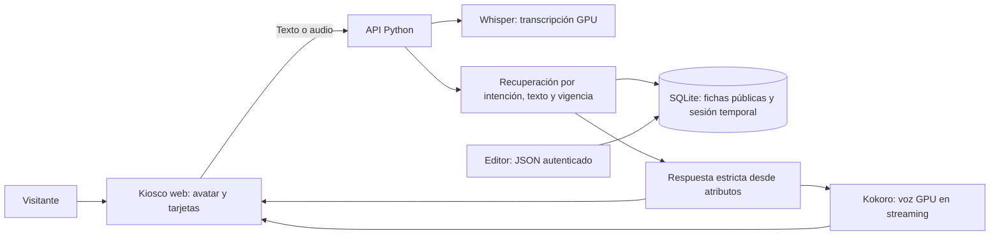

# Jarvis: presentación y demo

Presentación editable, organizada en ocho diapositivas. Tiempo sugerido: 5 minutos de presentación + 3 de demo; adaptar al tiempo oficial asignado. Fuente del reto: documento oficial, sección Jarvis. Las integraciones descritas al final son propuestas, no servicios conectados.

Archivo de diapositivas: [jarvis-reto.pptx](entregables/jarvis-reto.pptx). El detalle de la entrega 6–10 y sus pendientes está en [cierre-tareas-6-10.md](cierre-tareas-6-10.md).

## 1. Problema

**Encontrar, elegir y llegar, dentro de una sola conversación.**

Los visitantes consultan negocios, horarios, servicios, promociones y eventos en distintas fuentes. Un directorio ayuda a buscar nombres; el visitante también necesita una recomendación y saber qué información está confirmada.

## 2. Usuarios

Visitante presencial que busca una compra, comida, actividad o lugar de reunión. Familias que quieren entretenimiento. Negocios que necesitan comunicar información actual. Administración que necesita actualizar una fuente común y detectar consultas sin respuesta.

## 3. Solución y valor

Jarvis funciona como kiosco conversacional con texto, voz, avatar y tarjetas. Recupera fichas del Paseo, presenta fuente y ubicación, recuerda la opción elegida y responde con límites cuando falta información. Valor: reduce pasos de búsqueda y orienta una visita; no inventa una promoción para parecer más completo.

## 4. Funcionalidades actuales

Directorio público, servicio de Sky Games y FAQ del Paseo; recomendaciones por categorías/sinónimos; consultas múltiples; filtros de precio conocido; horarios con alcance; recuperación de promociones/eventos con vigencia; tarjetas por tipo; guía de ubicación; limpieza de sesión; voz GPU residente y streaming. Agenda/promociones requieren carga real: soporte técnico no equivale a contenido confirmado.

## 5. Arquitectura

## 6. Tecnología e implementación

Python HTTP/JSON, SQLite WAL, JavaScript, avatar Three.js, Docker Compose, WSL2, NVIDIA, Whisper y Kokoro. SQLite es el almacenamiento del RAG local; la recuperación actual es léxica con sinónimos, no embeddings. Modo estricto por defecto; síntesis OpenAI experimental optativa. El clima usa Open-Meteo. Kiosco escucha al pulsar el micrófono; no necesita conversación personal permanente.

## 7. Evidencia y límites

Las pruebas históricas cubrieron eventos frente a nombres de negocios, fechas, promociones, precios desconocidos, horarios en madrugada, borradores, selección y voz; no se volvieron a ejecutar para los últimos cambios. Datos oficiales publicados no son aprobación del Paseo. Falta cargar catálogo más completo, agenda, promociones, horarios particulares y plano validado. El generador de QR ahora es local; la URL accesible desde teléfono sigue pendiente de configurar.

## 8. Siguiente entrega

Con administración: validar datos y mapa, ensayar voz real y acceso móvil. Luego panel editorial, analítica y adaptadores autenticados para Points/PaseoYa. WhatsApp reutilizará el mismo conocimiento y tendrá escalamiento humano. Detalle: `docs/adicionales-e-integraciones.md`. El PPTX anterior conserva la situación al momento de su exportación; usar este guion actualizado para explicar el QR local.

## Guion de demo en vivo

Antes: abrir `http://localhost:8000`, comprobar `/health` y `/voice/status`, probar micrófono/parlantes, limpiar conversación. No depender del acceso a un LLM externo. Ensayar sin internet para búsqueda y voz ya descargada; clima y enlaces externos requieren red.

1. **Descubrir:** «Quiero una camisa y un café». Mostrar opciones de categorías distintas y sus fuentes; aclarar que no es stock garantizado.
2. **Elegir y ubicarse:** «Guíame al segundo». Mostrar piso/local cuando exista. No anunciar ruta interior confirmada si falta plano. Para una ubicación conocida, preguntar «Guíame a Crocs».
3. **Dato faltante:** «¿Cuánto cuesta un café?». Mostrar explicación de catálogo/precio desconocido.
4. **Servicio real:** «¿Qué servicios hay en Sky Games?». Mostrar ficha de servicio con precio desconocido y fuente oficial.
5. **Horarios:** «¿A qué hora abre Crocs?». Distinguir horario individual ausente y general publicado.
6. **Agenda y promociones:** «¿Qué eventos hay hoy?» y «¿Qué promociones hay?». Mientras no exista carga oficial, explicar ausencia de información confirmada. El motor se prueba con eventos/promociones ficticios únicamente en bases de pruebas.
7. **Atención:** «¿Dónde estaciono?». Respuesta pública sobre parqueo, con acceso y tarifa pendientes.
8. **Privacidad:** «¿Cuántos puntos tengo?». Explicar integración autenticada pendiente. Reiniciar y comprobar que no conserva selección.

Alternar texto y micrófono durante el ensayo. Si falla la GPU, demostrar texto y reportar la falla; no cambiar automáticamente a un proveedor de pago. No afirmar haber comprado, reservado ni canjeado.

## Preguntas previsibles del jurado

- **¿Usan RAG?** Sí: recuperamos evidencia del Paseo antes de responder. Usamos recuperación léxica y atributos estructurados; embeddings son una mejora evaluable.
- **¿Por qué SQLite?** Catálogo local pequeño, funcionamiento sin red y operación simple. Las integraciones privadas permanecen en sus propios sistemas.
- **¿Cómo evitan datos vencidos?** Ventanas temporales, separación por tipo, estados de revisión y fuente. Los cambios se cargan sin reiniciar.
- **¿Qué falta?** Datos autorizados y revisión operativa; plano; ensayo de voz con ruido real; conectar adaptadores externos.
- **¿Qué prueban hoy?** Flujo presencial funcional y tratamiento honesto de información conocida/desconocida.
