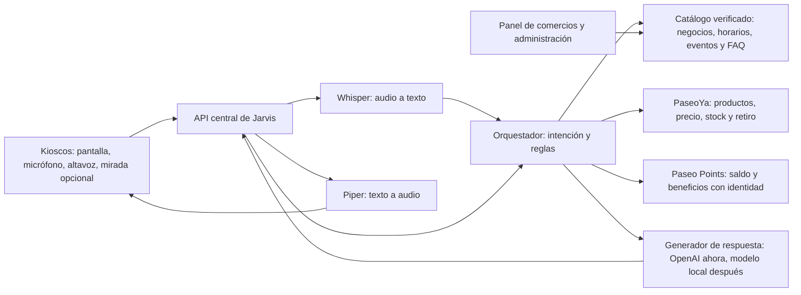

# Jarvis Paseo: asistente presencial verificable

**Propuesta central:** una red de puntos interactivos que entiende lo que el
visitante necesita, responde con datos vigentes de Paseo Aranjuez y lo conduce
desde una pregunta hasta una visita, un pedido para retiro o un beneficio.

El reto principal es **Jarvis Paseo**. PaseoYa y Paseo Points son integraciones
que demuestran valor del ecosistema; el documento oficial pide un MVP
funcional, una experiencia conversacional y una arquitectura que pueda
implementarse, no tres productos comerciales terminados.

## Experiencia del visitante

1. Una pantalla muestra una invitación breve al detectar presencia o al tocarla.
   El micrófono se activa cuando el visitante pulsa para hablar.
2. El visitante pregunta en lenguaje natural: «Necesito un regalo y después
   quiero tomar café».
3. Jarvis ofrece dos o tres opciones reales, explica por qué encajan y muestra
   piso, local y fuente. Si falta precio, horario o disponibilidad, lo dice.
4. Al mirar una tarjeta durante un tiempo sostenido, se resalta; tocarla o
   confirmarla por voz abre el detalle. El evento de mirada no compra ni canjea.
5. Un QR lleva la selección al móvil. En PaseoYa puede consultar el producto y
   hacer un pedido con **retiro presencial**. Si inicia sesión, Points muestra
   sus beneficios; el kiosco no expone saldos de otra persona.
6. Jarvis termina con una indicación concreta: dónde ir, qué confirmar y qué
   otra experiencia puede aprovechar durante la visita.

La pantalla siempre ofrece texto y controles táctiles. En un centro comercial
ruidoso, la interacción por turnos y los subtítulos son más confiables para el
MVP que intentar escuchar continuamente.

## Arquitectura propuesta

Los kioscos son clientes ligeros: pueden ser una Raspberry Pi con pantalla o
una tableta. Envían texto, audio corto y eventos de interacción a un servidor
local de Paseo Aranjuez. Las claves, modelos grandes y datos se administran en
ese servidor. Si hay varios kioscos, comparten el mismo catálogo y las mismas
reglas. Una caída de internet no debe impedir consultar información local ya
validada; pedidos y puntos requieren conexión con sus sistemas de origen.

**En la hackathon:** el Mac disponible puede hacer de servidor central y la
página web actual de kiosco. Ya existen `/chat`, ingesta de registros,
`/voice/transcribe`, `/voice/synthesize` y `/stimulus/gaze`. La voz se procesa
localmente; OpenAI solo sintetiza texto si se configura la clave. El modo local
de respaldo sigue funcionando. El endpoint actual de mirada activa una respuesta
al cumplir el tiempo mínimo; el resaltado y la confirmación son parte de la
experiencia propuesta para el kiosco definitivo.

**En operación:** servidor local dedicado con refrigeración, SSD, respaldo de
energía, monitoreo y actualizaciones; kioscos en la red interna. Si el número
de conversaciones simultáneas crece, se dimensionan trabajadores de voz y
modelo con mediciones reales antes de comprar hardware. Un modelo pequeño local
puede reemplazar gradualmente la generación remota, conservando el mismo
contrato de evidencia.

## La promesa de información verificable

RAG por sí solo **reduce la dependencia del conocimiento general del modelo,
pero no garantiza que cada frase sea correcta**. Jarvis debe aplicar estas
reglas de producto:

1. **Fuente canónica por dato.** Administración mantiene ubicación, horarios y
   eventos; PaseoYa mantiene precio, stock y estado de pedidos; Points mantiene
   saldo y movimientos. Jarvis consulta al dueño del dato.
2. **Vigencia y procedencia.** Cada ficha tiene `id`, responsable, `updated_at`,
   fuente y, cuando corresponde, `starts_at`/`expires_at` y estado. Una
   promoción vencida queda fuera antes de llamar al modelo.
3. **Respuesta acotada.** Primero se recuperan registros activos y se aplican
   filtros estructurados. El modelo redacta usando solo esa evidencia. Los
   campos críticos —precio, stock, horario, puntos y pedido— se muestran desde
   la API o base de datos, no desde una inferencia libre.
4. **Validación y abstención.** La evolución del agente debe pedir una salida
   estructurada con `answer`, `source_ids` y `unknowns`; el servidor comprueba
   que esos IDs existan entre las fuentes recuperadas. Si no hay evidencia
   suficiente, Jarvis pregunta o dice «no tengo ese dato confirmado». Nunca
   afirma que efectuó una compra o un canje sin una transacción verificada.
5. **Pruebas con preguntas reales.** Mantener un conjunto de preguntas sobre
   negocios abiertos, promociones vencidas, productos inexistentes, ubicaciones
   y consultas personales. Evaluar precisión, fuentes y abstenciones en cada
   cambio de modelo o catálogo.

Para un catálogo inicial pequeño, búsqueda de texto y campos como categoría y
etiquetas son suficientes. La búsqueda vectorial se incorpora si las pruebas
demuestran que faltan resultados por sinónimos o lenguaje natural. El clima,
si forma parte de la experiencia, viene de un servicio meteorológico consultado
y almacenado por un tiempo corto; no se le pregunta al LLM como fuente.

## Integración visible de los tres retos

| Intención | Fuente y acción de Jarvis | Continuación |
| --- | --- | --- |
| «¿Dónde compro un regalo?» | Busca productos y negocios confirmados, explica ubicación. | QR a producto de PaseoYa. |
| «¿Hay stock y cuánto cuesta?» | Consulta precio y stock vigentes en PaseoYa. | Pedido con retiro presencial en PaseoYa. |
| «¿Cuántos puntos tengo?» | Solicita autenticación; consulta Points en vivo. | Beneficios o canje en la cuenta del visitante. |
| «¿Qué hay hoy?» | Filtra eventos y promociones por fecha y estado. | Ruta al local o evento. |

El QR permite continuar en el teléfono sin escribir datos personales en una
pantalla pública. Jarvis recomienda y orienta; los flujos de compra, pago y
canje pertenecen a las aplicaciones responsables.

## Demostración para el jurado

1. **Descubrimiento:** una persona pide un regalo y café. Jarvis responde con
   negocios reales, ubicación y fuentes visibles; se puede profundizar en uno
   por voz o con la mirada simulada.
2. **Conversión:** la persona pregunta precio/disponibilidad de un producto y
   abre PaseoYa por QR. El recorrido termina en pedido para retiro en el Paseo.
3. **Fidelización:** tras iniciar sesión en su móvil, consulta Points y ve un
   beneficio aplicable. Jarvis no lee saldos sin identidad.
4. **Confianza:** se pregunta por un negocio inexistente o una promoción
   vencida. Jarvis reconoce que no tiene información confirmada.
5. **Actualización:** administración cambia una ficha; la siguiente pregunta
   usa el nuevo dato sin volver a entrenar el modelo.

Para esta demostración hacen falta fichas **reales y aprobadas**: negocios,
horarios, ubicación por piso/local, algunos productos, promociones con fecha y
eventos. Los registros ficticios actuales solo sirven para probar el software.

## Prioridades hasta el domingo a las 10:00

| Prioridad | Entrega verificable |
| --- | --- |
| 1 | Cargar datos reales con responsable, vigencia y ubicación; probar preguntas del reto oficial. |
| 2 | Acordar con PaseoYa y Points IDs, URLs y respuestas de lectura. Integrar al menos un recorrido de producto y uno de beneficio. |
| 3 | Probar una llamada real de OpenAI desde el servidor y conservar el respaldo local. Nunca poner la clave en kioscos ni navegador. |
| 4 | Medir el tiempo de voz completo. El prototipo inicia `whisper-cli` por petición; si la espera afecta la demo, mantener el modelo cargado en un trabajador persistente. |
| 5 | Ensayar la demo sin internet y con ruido. Preparar una pregunta desconocida que demuestre la abstención. |

El eye tracker físico, un avatar complejo, conversación simultánea y un LLM
totalmente local son evoluciones valiosas. Para el jurado, la prueba decisiva es
que Jarvis escuche, encuentre datos propios del Paseo, responda con fuentes y
lleve a una acción real dentro del ecosistema.

## Indicadores de un piloto real

- Porcentaje de respuestas con fuente verificable y vigencia correcta.
- Porcentaje de preguntas sin datos donde Jarvis se abstiene correctamente.
- Tiempo desde que termina la pregunta hasta la primera respuesta útil.
- Consultas que terminan en ruta, QR, pedido o beneficio.
- Disponibilidad del servidor y edad máxima de las fichas del catálogo.

La interacción debe ser memorable **porque resuelve la necesidad del visitante**:
una conversación breve, información concreta y una continuación inmediata en
el Paseo o en su teléfono.

## Referencias

- [Documento oficial de retos](retos/Hackathon_By_Paseo_Aranjuez_Documento_Oficial_de_Retos.pdf): capacidades de Jarvis, integración y entregables.
- [Structured Outputs de OpenAI](https://developers.openai.com/api/docs/guides/structured-outputs): contrato de salida para la futura validación de fuentes.
- [Raspberry Pi 5](https://www.raspberrypi.com/products/raspberry-pi-5/): opción de cliente ligero o piloto local.
- [whisper.cpp](https://github.com/ggml-org/whisper.cpp) y [Piper](https://github.com/OHF-Voice/piper1-gpl): voz local del prototipo.
